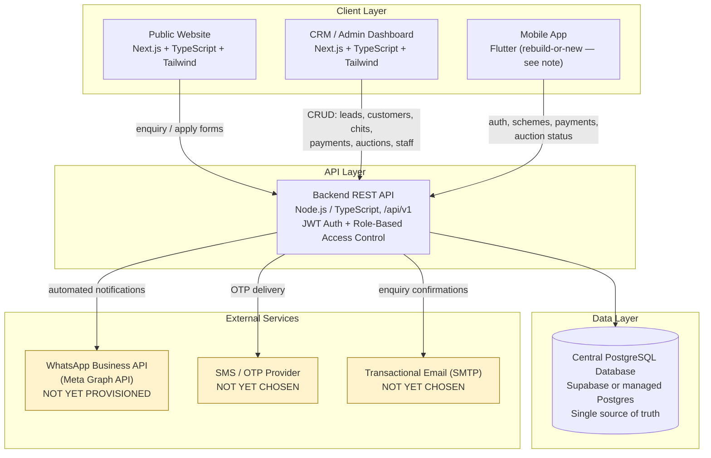

# /docs/02-system-architecture.md
# NACHIYAR CHIT & FINANCE PVT LTD — Recommended System Architecture

**Status:** Proposed architecture for approval. Nothing below has been built. This reflects the audit findings in `01-project-audit.md` — specifically, that no backend, database, or working API currently exists behind either the website URL or the mobile APK.

---

## 1. Architecture Diagram

**Legend:** Yellow-highlighted nodes (WhatsApp, SMS/OTP, Email) represent services with **no current credentials or provider selection** — see `01-project-audit.md`, Section 12.

## 2. Component Notes

**Public Website**
Serves the 12 sections defined in scope (Home, About, Chit Schemes, Scheme Details, How Chit Works, Auction Process, Benefits, FAQ, Contact, Apply/Enquiry, Privacy Policy, Terms & Conditions). Submits enquiry/apply forms to the backend API, which creates `leads` records — this is the single entry point into the CRM's lead pipeline, avoiding a second disconnected contact-form data store.

**CRM / Admin Dashboard**
Consumes the same backend API as the website and mobile app. No direct database access from the frontend — everything goes through `/api/v1`, so authorization rules live in one place.

**Mobile App**
Per the audit, the current APK has no backend connection of any kind. Two paths remain open (client decision required, not resolved by this document):
- **Rebuild on existing UI shell** — requires the Flutter *source* repository, which has not been supplied (only the compiled APK). Would reuse the screen structure already reflected in the APK's compiled paths.
- **New development** — build a fresh Flutter (or other) client against the new backend, using the APK's screen list purely as a feature/UX reference.

**Backend API**
Single API surface for all three clients (website, CRM, mobile). Versioned (`/api/v1`) so future breaking changes don't require simultaneous client updates. Enforces JWT-based authentication and role checks for the six roles defined in the brief (Super Admin, Admin, Manager, Staff, Accountant, Read Only).

**Database**
PostgreSQL, either via Supabase (bundles auth/storage alongside Postgres) or a self-hosted/managed Postgres instance — a final choice is deferred to Phase 2, since it doesn't change the schema design itself. This is the **single source of truth**: no separate data stores per client, per the brief's own core principle.

**WhatsApp Business API**
Not yet provisioned — see audit Section 7 and Section 12. Once the client sets up a Meta Business Account and WhatsApp Business Account, the backend calls Meta's Graph API directly; credentials are stored as environment variables (`WHATSAPP_ACCESS_TOKEN`, `WHATSAPP_PHONE_NUMBER_ID`, `WHATSAPP_BUSINESS_ACCOUNT_ID`, `WHATSAPP_API_VERSION`) and never committed to source.

**SMS/OTP and Email**
Provider not yet chosen for either. Required only if mobile OTP login (suggested by the APK's `otp_screen.dart`, but not yet confirmed as the intended flow) and website enquiry-confirmation emails are both in scope — pending client confirmation per audit Section 11.

## 3. What This Diagram Deliberately Does Not Show

- No specific hosting platform is fixed (Vercel/VPS/other) — this is a deployment decision for Phase 10, not an architectural one.
- No database table/field detail — that's `03-database-design.md` in Phase 2, not this document.
- No decision between the two mobile-app paths — that requires a client answer (audit Section 9/12) before it can be drawn as a single fixed box.

---

**No Phase 2 work has begun.** This document, together with `01-project-audit.md`, completes Phase 1 deliverables as requested.
