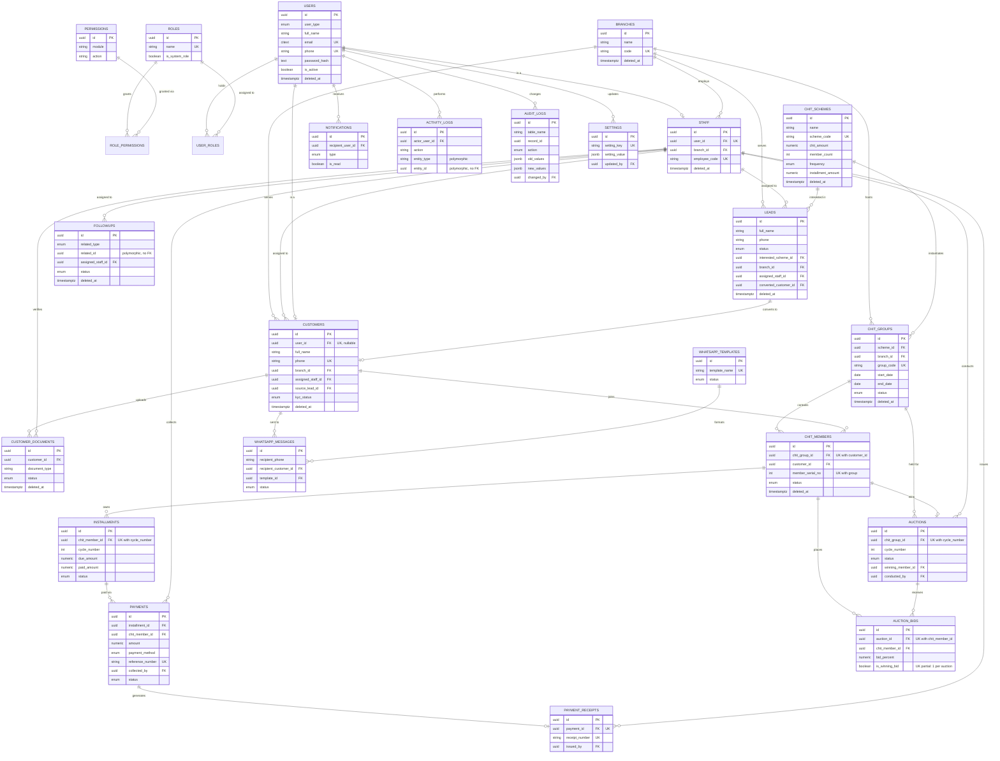

# /docs/03-database-design.md
# NACHIYAR CHIT & FINANCE PVT LTD — Database Design (Phase 2)

**Status:** Schema designed, migrated, and validated against a live PostgreSQL 16 instance as part of this phase (see Section 8). No UI or API code has been built. This document, the migrations under `/database/migrations/`, and the dev seed under `/database/seeds/` are the complete Phase 2 deliverable.

**Scope decision — tables NOT built:** the brief listed 22 candidate entities. All were evaluated; every one is used except that `permissions` was kept (needed for real RBAC) while a separate "modules" table was deliberately **not** added — the action list is small enough that `permissions.module` as a plain varchar is sufficient, and a lookup table for ~6 module names would be over-engineering. No entity from the candidate list was dropped outright.

---

## 1. Entity-Relationship Diagram



---

## 2. Tables, Columns, Keys, Indexes (as actually migrated and verified)

Verified against the live schema with `\d+` after running all 9 migrations — column types/defaults below are exact, not approximated.

### 2.1 Auth & RBAC

**`users`** — single identity table for both staff and customer logins.
| Column | Type | Notes |
|---|---|---|
| id | UUID PK | `gen_random_uuid()` |
| user_type | ENUM(`staff`,`customer`) | NOT NULL |
| full_name | VARCHAR(150) | NOT NULL |
| email | CITEXT | UNIQUE, case-insensitive |
| phone | VARCHAR(20) | UNIQUE, NOT NULL |
| password_hash | TEXT | nullable (OTP-only accounts) |
| is_active | BOOLEAN | default TRUE |
| last_login_at | TIMESTAMPTZ | |
| created_at / updated_at | TIMESTAMPTZ | auto-managed |
| deleted_at | TIMESTAMPTZ | soft delete |

Indexes: partial indexes on `user_type` and `is_active` (both `WHERE deleted_at IS NULL`, so soft-deleted rows never pollute lookups).

**`roles`**, **`permissions`**, **`role_permissions`**, **`user_roles`** — standard RBAC join structure. `roles` is a table (not an enum) so new roles can be added without a migration; seeded with the brief's 6 roles flagged `is_system_role = TRUE` to protect them from accidental deletion at the application layer.

### 2.2 Organization

**`branches`** — PK `id`, unique `code`, soft-delete. Only one branch (Velpadi) is confirmed real per Phase 1; schema is multi-branch-ready per the brief's explicit requirement.

**`staff`** — one-to-one with `users` (`UNIQUE(user_id)`), FK to `branches` (`ON DELETE RESTRICT` — a branch with active staff cannot be deleted out from under them).

### 2.3 CRM

**`leads`** — `status` ENUM matches the brief exactly: `new, contacted, interested, follow_up, converted, lost`. FKs to `branches`, `staff` (assigned), `chit_schemes` (interest), and `customers` (post-conversion) — the last two were added via `ALTER TABLE` in later migrations since `chit_schemes`/`customers` didn't exist yet when `leads` was first created (documented, not a workaround — see migration file comments). GIN trigram indexes on `full_name` and `phone` for fast partial-match search in the CRM's lead search box.

**`customers`** — FK to `users` is nullable and unique (a customer may exist before ever activating a login), unique `phone`. `kyc_status` reuses the `document_status_enum` (`pending/verified/rejected`) rather than inventing a duplicate type.

**`customer_documents`** — KYC documents, one row per uploaded file, `status` + `verified_by`/`verified_at`/`rejection_reason` for the verification workflow.

**`followups`** — deliberately polymorphic: `related_type` (`lead`|`customer`) + `related_id` with **no foreign key** on `related_id`, since it can point to either table. This is documented in a table comment; referential integrity for that column is an application-layer responsibility, not a database one.

### 2.4 Chit Core

**`chit_schemes`** — the reusable product templates (Silver, Gold-A1/A2, Diamond-A1/A2, Platinum, Honey Weekly, SuperJet). Hard `CHECK` constraint: `chit_amount = installment_amount * member_count` — this is verified to match every table published in the company presentation, and the constraint **actively rejects** any scheme that doesn't add up (tested in Section 8).

**`chit_groups`** — a running batch of a scheme at a branch. `CHECK(end_date > start_date)`, unique `group_code`.

**`chit_members`** — join of `customers` into a `chit_groups` batch. Two composite uniques: `(chit_group_id, customer_id)` — one seat per customer per group — and `(chit_group_id, member_serial_no)` — no duplicate ticket numbers within a group.

### 2.5 Payments

**`installments`** — the *expected* dues, one row per member per cycle (`UNIQUE(chit_member_id, cycle_number)`). `CHECK(paid_amount <= due_amount)`. **No soft delete** — an installment is a financial obligation record and must never disappear; corrections happen via `status` (e.g. `waived`), never deletion.

**`payments`** — the *actual* money received; many payments can apply against one installment (partial payments). All monetary columns are `NUMERIC(14,2)` — **never floating point**, avoiding rounding drift on currency math. `collected_by` → `staff`. No soft delete and no in-place amount edits by convention — a wrong payment is corrected with a new row (`status = refunded`/`reversed`), preserving full history.

**`payment_receipts`** — one receipt per payment (`UNIQUE(payment_id)`), unique `receipt_number`.

### 2.6 Auctions

**`auctions`** — one per `(chit_group_id, cycle_number)`. `winning_member_id` → `chit_members`. No soft delete (financial/legal event record).

**`auction_bids`** — one bid row per `(auction_id, chit_member_id)` (bid revisions update the row while the auction is live, rather than inserting duplicates). A **partial unique index** (`WHERE is_winning_bid = TRUE`) guarantees at most one winner per auction — enforced and tested in Section 8, since a plain `CHECK` constraint cannot reference other rows.

### 2.7 Communications

**`notifications`** — in-app feed only, FK to `users` (recipient), polymorphic `related_entity_type`/`related_entity_id` (informational, no FK, same reasoning as `followups`).

**`whatsapp_templates`** — registry of Meta-approved templates. Per Phase 1 audit, **no real Meta/WABA access exists yet**, so this table is structural groundwork; the dev seed inserts exactly one template with `status = pending` to reflect that honestly, not a fabricated "approved" one.

**`whatsapp_messages`** — outbound log/audit trail, FK to `customers` and `whatsapp_templates` (both nullable — a message might target a lead or use no template), `status` tracks the full Meta delivery lifecycle (`queued → sent → delivered → read` or `failed`).

### 2.8 Audit & Settings

**`activity_logs`** — lightweight, human-readable "who did what," polymorphic `entity_type`/`entity_id` (no FK — spans every table in the system, a real FK isn't possible here).

**`audit_logs`** — compliance-grade, field-level `old_values`/`new_values` as `JSONB`, GIN-indexed for querying inside the diff. Intended to be written by the application layer on every change to a financially/legally sensitive table (customers, chit_members, installments, payments, auctions, auction_bids). Append-only by convention (documented in a table comment) — not database-enforced via trigger, so the write path stays owned by the API layer rather than silently duplicated in the database.

**`settings`** — key-value app configuration (`JSONB` value), explicitly **never used for secrets** — API keys/tokens stay in environment variables per the project's security rules, documented directly in the table comment so this isn't relitigated later.

---

## 3. Relationships Summary

- `users` 1—0/1 `staff` (a user is either staff or not)
- `users` 1—0/1 `customers` (a customer may or may not have activated login)
- `branches` 1—N `staff`, `customers`, `leads`, `chit_groups`
- `chit_schemes` 1—N `chit_groups` (a product spawns many running batches)
- `chit_groups` 1—N `chit_members` 1—N `installments` 1—N `payments` 1—1 `payment_receipts`
- `chit_groups` 1—N `auctions` 1—N `auction_bids`, with `auctions.winning_member_id` → `chit_members`
- `leads` 0/1—1 `customers` via `converted_customer_id` (nullable until conversion)
- `roles` M—N `permissions` via `role_permissions`; `users` M—N `roles` via `user_roles`

## 4. Constraints Summary

- **CHECK constraints** enforce: positive amounts everywhere money is stored, `chit_amount = installment_amount × member_count` on schemes, `paid_amount ≤ due_amount` on installments, valid percentage ranges (0–100) on bid/commission fields, `end_date > start_date` on chit groups.
- **UNIQUE constraints** enforce: one seat per customer per chit group, one serial number per group, one installment per member per cycle, one receipt per payment, one winning bid per auction (via partial unique index), unique phone/email per user, unique scheme/branch/group codes.
- **Foreign keys** use `ON DELETE RESTRICT` for anything that would silently orphan financial history (branches referenced by staff/customers/groups, chit_members referenced by installments, installments referenced by payments) and `ON DELETE SET NULL` for optional/soft associations (assigned staff, converted customer, recipient customer on a WhatsApp message).

## 5. Money & Data-Type Rules Applied

- Every currency column is `NUMERIC(14,2)` — chosen deliberately over `FLOAT`/`DOUBLE PRECISION`, which cannot represent currency exactly and accumulate rounding error over many transactions. `NUMERIC(14,2)` supports values up to 99,99,99,99,99,999.99 — far beyond the largest scheme in the presentation (₹1,00,00,000 Platinum).
- All primary keys are `UUID` (`gen_random_uuid()`, native to Postgres 13+, no extension dependency) rather than serial integers — avoids leaking record counts/creation order and makes multi-environment (dev/staging/prod) data merges safe.
- All timestamps are `TIMESTAMPTZ`, never naked `TIMESTAMP` — avoids timezone ambiguity given the business operates in IST but may have infrastructure in another zone.
- `created_at`/`updated_at` are present on every table where rows are ever modified after creation, with `updated_at` auto-maintained by the shared `set_updated_at()` trigger (Migration 0001) rather than relying on application code to remember it.

## 6. Soft-Delete Strategy

`deleted_at TIMESTAMPTZ` is applied **only** to tables representing entities that can legitimately be "removed" from active use while still needing historical traceability: `users`, `branches`, `staff`, `leads`, `customers`, `customer_documents`, `chit_schemes`, `chit_groups`, `chit_members`, `followups`.

It is **deliberately not applied** to `installments`, `payments`, `payment_receipts`, `auctions`, `auction_bids`, `activity_logs`, `audit_logs` — these are financial/legal event records. Deleting a payment or auction row, even "softly," is the wrong model for a regulated chit-fund business; corrections are made via status fields (`refunded`, `reversed`, `waived`, `cancelled`) that preserve the row, which is the correct behavior for anything that might be audited by a regulator or disputed by a customer.

## 7. Audit Strategy

Two complementary, intentionally separate mechanisms:

1. **`activity_logs`** — product-facing. Powers "recent activity" feeds in the CRM dashboard (per the brief's Dashboard requirement). Cheap to write, human-readable `action` strings, not meant for legal defensibility.
2. **`audit_logs`** — compliance-facing. Full before/after `JSONB` snapshots (`old_values`/`new_values`), `changed_by`, `ip_address`, `user_agent`, `changed_at`. Written by the backend API on every mutation to `customers`, `chit_members`, `installments`, `payments`, `auctions`, and `auction_bids` — the tables where a dispute or regulatory review would need a precise record of exactly what changed, when, and by whom. Implemented at the **application layer** (not a database trigger) deliberately: this keeps all business-write logic in one place (the API), makes it trivial to attach the acting user's IP/user-agent (not available inside a DB trigger), and avoids the common trap of DB-level audit triggers silently missing bulk/administrative operations run directly against the database.

Both tables are populate-only from the API's perspective — no update/delete path should ever be exposed for either, by convention enforced in the API layer in Phase 3, not by a database-level rule (documented here so that decision isn't lost).

## 8. Validation Performed

This schema was not just written — it was **run**. As part of this phase:

1. Installed PostgreSQL 16.15 in the working environment.
2. Applied all 9 migration files in order, from a clean database, with `ON_ERROR_STOP=1`. All 9 succeeded on the second attempt after fixing one ordering bug (the `citext` extension needed to be created before the `users` table used the `CITEXT` type — caught immediately by the failure, fixed, and re-validated from scratch).
3. Confirmed the resulting schema: **25 tables, 39 foreign-key constraints, 106 indexes.**
4. Ran the dev seed script end-to-end — all inserts succeeded.
5. Ran a 6-table join query (customers → chit_members → chit_groups → chit_schemes → installments) and got correct, expected output.
6. Ran a join proving the auction-winner relationship resolves correctly (auction → winning chit_member → customer).
7. **Actively tried to break the business-rule constraints** to prove they're real, not decorative:
   - Attempted to insert a chit scheme where `chit_amount ≠ installment_amount × member_count` → correctly rejected with `chk_chit_schemes_amount_consistency` violation.
   - Attempted to mark a second bid as winning in an auction that already had a winner → correctly rejected with a unique-index violation on `uq_auction_bids_one_winner_per_auction`.

This is the strongest confidence available short of running it against real application code: the schema is internally consistent, enforces the money-safety and one-winner/one-seat business rules it claims to, and a clean install-to-seed run works without manual intervention.

## 9. How to Run the Migrations

```bash
# 1. Create the database and a role (adjust names/password for your environment)
psql -U postgres -c "CREATE USER nachiyar_dev WITH PASSWORD 'changeme';"
psql -U postgres -c "CREATE DATABASE nachiyar_chit OWNER nachiyar_dev;"

# 2. Apply migrations IN ORDER — filenames are numbered for exactly this reason.
#    Never skip a number or run them out of order; later files assume earlier
#    files' tables/types already exist (e.g. 0004 creates leads before customers
#    exists, then 0005 adds the deferred foreign key once chit_schemes exists).
cd database/migrations
for f in $(ls *.sql | sort); do
  psql -h <host> -U nachiyar_dev -d nachiyar_chit -v ON_ERROR_STOP=1 -f "$f"
done

# 3. (Development only) load fictional seed data
psql -h <host> -U nachiyar_dev -d nachiyar_chit -f ../seeds/dev_seed.sql
```

**Never run `seeds/dev_seed.sql` against a production database** — it exists purely to give Phase 3+ development something realistic to build against, and every person in it is explicitly fictional (see the file's own header comment).

For Phase 3 onward, this loop should be replaced by a real migration tool (e.g. `node-pg-migrate`, Prisma Migrate, or Supabase's own migration CLI) that tracks which migrations have already run — the manual loop above is sufficient for this validation pass but is not the intended production workflow.

---

**No API or UI code has been written.** Phase 2 stops here, per instruction.
